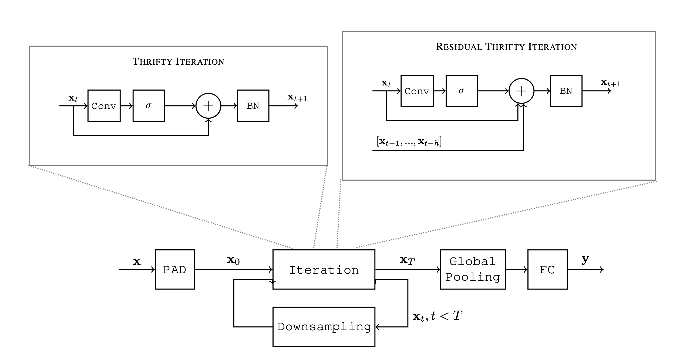

# Thrifty Networks

<div align="center">
    
</div>

## Installation

```bash
pip install thriftynet
```

## Abstract

Typical deep convolutional architectures present an increasing number of feature maps as we go deeper in the network, whereas spatial resolution of inputs is decreased through downsampling operations. This means that most of the parameters lay in the final layers, while a large portion of the computations are performed by a small fraction of the total parameters in the first layers.

In an effort to use every parameter of a network at its maximum, we propose a new convolutional neural network architecture, called ThriftyNet. In ThriftyNet, only one convolutional layer is defined and used recursively, leading to a maximal parameter factorization.

In complement, normalization, non-linearities, downsamplings and shortcut ensure sufficient expressivity of the model. ThriftyNet achieves competitive performance on a tiny parameters budget, exceeding 91% accuracy on CIFAR-10 with less than 40K parameters in total, and 74.3% on CIFAR-100 with less than 600K parameters.

## Usage

```py
from thriftynet import ThriftyEncoder

encoder = ThriftyEncoder(filters=128, iterations=20, kernel_size=3, normalization="layer")
images = torch.randn(1, 3, 224, 224)
features = encoder(images)
print(features.size(1))
# prints 128
```

## Citation

```bibtex
@misc{2007.10106,
    Author = {Guillaume Coiffier and Ghouthi Boukli Hacene and Vincent Gripon},
    Title = {ThriftyNets : Convolutional Neural Networks with Tiny Parameter Budget},
    Year = {2020},
    Eprint = {arXiv:2007.10106},
}
```